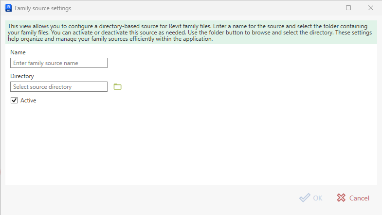

# Adding a Directory Family Source

A **Directory family source** connects Bim.FamilyManager to a local or network folder that contains Revit family files (`.rfa`).

This is the simplest source type and typically used for:
- an office library folder on a file server
- discipline-specific folders (ELT, HLS, GA, …)
- a local “work-in-progress” library during development

## Dialog fields

### Name (required)

A user-friendly name shown in the list of sources and throughout the UI. Keep it short and recognizable, e.g.:

- `Mechanical`
- `Electrical`
- `Plumbing`

### Directory (required)

The folder path that contains your family files. You can:

- paste/type the path directly, or
- click the folder button to browse and select a directory

Examples:

- `C:\BIM\RevitFamilies\Furniture`
- `\\Server\Shared\Families\Plumbing`

### Active

If enabled, the source is used when browsing/searching families. You can also toggle this later in the source list.

## Steps

1. Open **Settings → Family Sources**.
2. Click **Add** and select **Directory**.
3. Enter a **Name**.
4. Select the **Directory** (folder).
5. Optionally uncheck **Active** if you don’t want to use it immediately.
6. Click **OK**.
7. Click **Save** in the settings dialog to persist.

## Notes and best practices

- **Permissions & availability:** Make sure the directory is reachable from the machine where Revit runs (especially for network shares).
- **Drive mappings:** If you work with multiple machines/users, prefer UNC paths over mapped drives to avoid inconsistencies.
- **Performance:** Very large folders can take longer to enumerate. Consider splitting huge libraries into multiple sources.

[Back to Managing Family Sources](Managing%20Family%20Sources.md)
