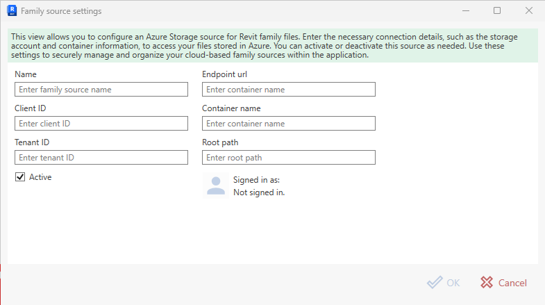

# Adding an Azure Family Source

An **Azure family source** connects Bim.FamilyManager to a library stored in **Azure Blob Storage**.

Authentication is done via **Azure Active Directory (Entra ID)** using:
- **Client ID** (application ID)
- **Tenant ID**
- interactive sign-in (with silent sign-in when possible)

## Prerequisites

To use an Azure family source you typically need:

- An **Azure Storage Account** (Blob storage)
- A **Blob container** that contains `.rfa` files
- An **Azure AD application registration** (for interactive sign-in)
- Appropriate permissions for the signed-in user (e.g. *Storage Blob Data Reader* or higher on the container/account)

> The exact permission model depends on how your organization manages Azure. If you’re unsure, ask your Azure admin to provide a Client/Tenant ID pair and grant access to the container.

## Dialog fields

### Name (required)

A user-friendly name shown in the UI (e.g. `Azure`, `Company Cloud Families`).

### Endpoint url (required)

The storage endpoint URL, for example:

- `https://<account>.blob.core.windows.net`

### Container name (required)

The name of the blob container where families are stored, e.g. `families`.

### Root path (required)

A virtual “folder” path inside the container that scopes the source to a sub-tree.

Examples:

- `Families`
- `Libraries/MEP`
- `Revit/2025`

This value is also shown in the **Source** column in the Family Sources list.

### Client ID (required, GUID)

The application (client) ID of your Azure AD app registration, as a GUID.

### Tenant ID (required, GUID)

Your Azure AD (Entra) tenant ID, as a GUID.

### Active

If enabled, the source is used when browsing/searching families.

### Signed in as

Shows the currently signed-in account. When not signed in, it displays **“Not signed in.”**.

## Signing in

- If all required fields are valid, the dialog enables sign-in.
- Bim.FamilyManager attempts a **silent sign-in** when possible (using cached tokens).
- If silent sign-in is not possible, use the **Sign in** action to authenticate interactively.

Token caching:
- Tokens are cached per user under the local profile (LocalAppData) in a folder named `BIM.FamilyManager`.
- The cache file name contains the client id (e.g. `msal_cache_<clientId>.bin`).

## Steps

1. Open **Settings → Family Sources**.
2. Click **Add** and select **Azure Storage**.
3. Fill in **Name**, **Endpoint url**, **Container name**, **Root path**, **Client ID**, and **Tenant ID**.
4. Click **Sign in** (if not signed in already).
5. Confirm with **OK**.
6. Click **Save** in the settings dialog to persist.

## Troubleshooting

- **“Not signed in.” stays visible**
  - Verify **Client ID** and **Tenant ID** are valid GUIDs.
  - Ensure the signed-in user has access to the storage container/account.
- **Families are not found**
  - Confirm `Endpoint url` and `Container name` are correct.
  - Check that your families exist under the specified **Root path**.
- **Sign-in button disabled**
  - One or more required fields are missing or invalid (Client/Tenant IDs must be GUIDs).

[Back to Managing Family Sources](Managing%20Family%20Sources.md)
