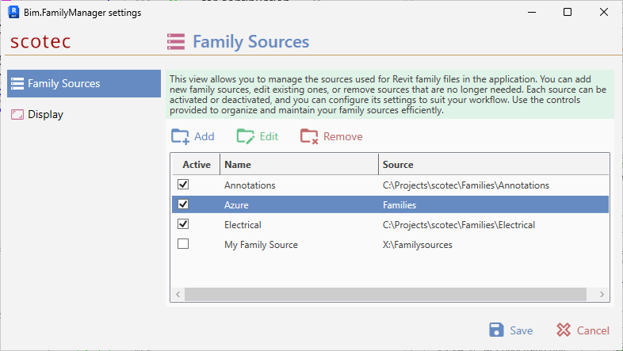
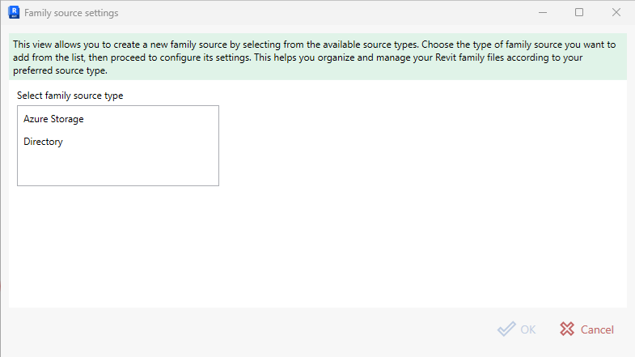

# Managing Family Sources

The **Family Sources** page in the settings dialog is where you add, edit, remove and enable/disable the locations that Bim.FamilyManager uses to find Revit family files.

## The Family Sources list

Each row represents one configured source.

- **Active**  
  Whether the source is enabled. Only active sources are used for browsing/searching.
- **Name**  
  A user-friendly name shown throughout the UI (e.g. “Electrical”, “Furniture”, “Azure”).
- **Source**  
  The source “address”, depending on type:
  - Directory source: the folder path (e.g. `C:\Projectsscotec\Families\Electrical`)
  - Azure Storage source: the configured **Source** inside the container (e.g. `Families`)

> Disabling a source does **not** delete anything. It only prevents Bim.FamilyManager from using that source until you re-enable it.

## Adding a new source

1. Open **Settings → Family Sources**.
2. Click **Add**.
3. Choose a source type in the list and confirm with **OK**.

4. Configure the source in the next dialog:
   - [Directory source](Adding%20a%20Directory%20Family%20Source.md)
   - [Azure Storage source](Adding%20an%20Azure%20Family%20Source.md)
5. Confirm with **OK** to add the source to the list.
6. Click **Save** in the main settings window to persist your changes.

> Changes made in the settings dialog are only written when you press **Save**. Use **Cancel** to discard changes.

## Editing an existing source

1. Select a source row.
2. Click **Edit**.
3. Adjust the configuration.
4. Confirm with **OK**.
5. Click **Save** to persist.

## Removing a source

1. Select a source row.
2. Click **Remove**.
3. Confirm the prompt.
4. Click **Save** to persist.

Removing a source only removes the configuration entry. It never deletes your families from disk or from Azure.

## Activating / deactivating sources

You can toggle the **Active** checkbox directly in the list. This is useful when you temporarily don’t want a source to be used (e.g. when working offline or when a network share is unavailable).

## Tips

- Use **clear, stable names** (“GA”, “HLS”, “Plumbing”) so your team can align on the same conventions.
- Prefer **UNC paths** (e.g. `\\server\share\Families`) over mapped drives when you work across different machines.
- Keep sources **scoped**. Many very large roots (especially Azure) can increase initial indexing/browsing time.

