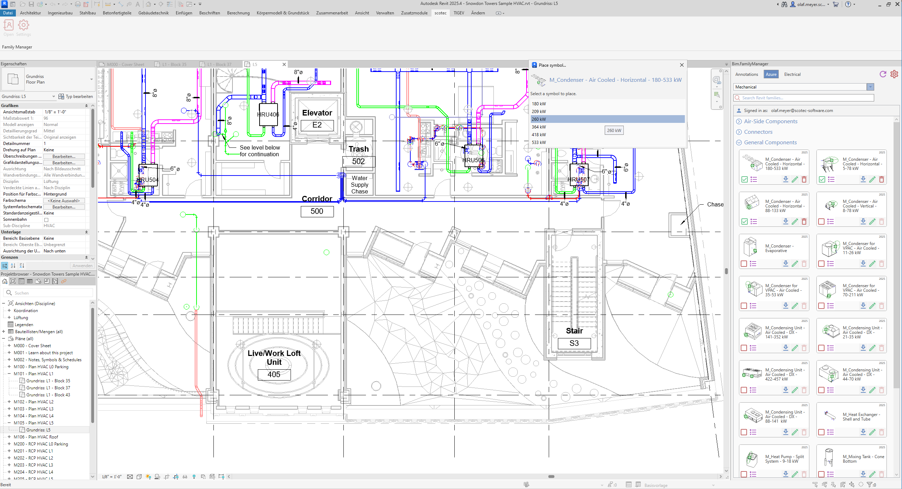
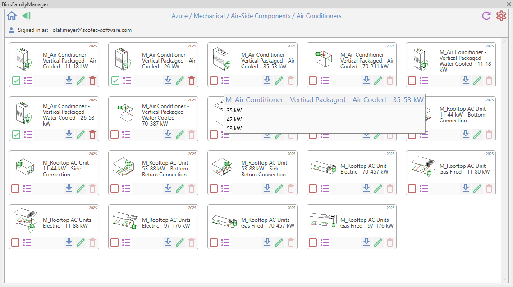

# Bim.FamilyManager

**Bim.FamilyManager** is an open-source **Autodesk® Revit® add‑in** that simplifies how Revit family libraries are organized, discovered, and deployed across teams and projects.

It provides a modern interface for browsing and loading Revit family files (`.rfa`) from **multiple configurable sources**, including **local directories** and **Azure Blob Storage**. The goal is to make family libraries easier to manage while remaining fully integrated in the Revit workflow.

> **Compatibility:** Autodesk® Revit® **2025** and **2026**

---

# Features

### Centralized Family Management
Browse, organize, and load Revit families from multiple sources within a single interface.

### Multiple Source Support
Connect family libraries from:
- Local folders
- Network shares
- Azure Blob Storage

### Modern User Interface
Clean and responsive WPF interface with customizable layouts and themes.

### Drag & Drop Support
Add or load families using intuitive drag-and-drop functionality.

### Configurable Sources
Enable, disable, or configure multiple family sources depending on your workflow.

### Extensible Architecture
Designed for easy integration of additional storage providers or UI customizations.

---

# Screenshots






---

# Documentation

Detailed documentation is available in the **Documentation** folder.

- [Introduction](Documentation/Introduction.md)
- [Managing Family Sources](Documentation/Managing%20Family%20Sources.md)
- [Adding a Directory Family Source](Documentation/Adding%20a%20Directory%20Family%20Source.md)
- [Adding an Azure Family Source](Documentation/Adding%20an%20Azure%20Family%20Source.md)

The documentation explains how to configure and manage family libraries stored locally, on network shares, or in Azure Blob Storage.

---

# Getting Started

## Prerequisites

- Autodesk **Revit 2025 or newer**
- **.NET 8 SDK**
- Windows OS

Download .NET:

https://dotnet.microsoft.com/en-us/download/dotnet/8.0

---

# Building the Project

## 1. Clone the repository

```bash
git clone https://github.com/scotec-Software-Solutions-AB/Bim.FamilyManager.git
cd Bim.FamilyManager
```

## 2. Build the solution

Using the .NET CLI:

```bash
dotnet build
```

Or open the solution in **Visual Studio** and build normally.

---

# Installing the Add‑In

Copy the compiled DLLs and the `.addin` manifest file to one of the Revit Add‑In folders.

Example locations:

**Machine-wide installation**

```
C:\ProgramData\Autodesk\Revit\Addins\2025\
```

**Per-user installation**

```
C:\Users\<username>\AppData\Roaming\Autodesk\Revit\Addins\2025\
```

After installation, restart Revit.

The **Bim.FamilyManager** ribbon panel will appear in the **scotec** tab.

---

# Configuring Family Sources

After starting the add-in:

1. Open **Settings**
2. Navigate to **Family Sources**
3. Add a source (Directory or Azure Storage)
4. Configure the connection
5. Save the settings

More details:

- [Managing Family Sources](Documentation/Managing%20Family%20Sources.md)

---

# Project Structure

| Project | Description |
|-------|-------------|
| **Bim.FamilyManager** | Main add‑in logic and Revit integration |
| **Bim.FamilyManager.Abstractions** | Shared interfaces and contracts |
| **Bim.FamilyManager.Base** | Core implementations and shared utilities |
| **Bim.FamilyManager.Ui** | Shared UI components |
| **Bim.FamilyManager.Ui.Standard** | Classic WPF interface |
| **Bim.FamilyManager.Ui.Modern** | Modern WPF interface |
| **Bim.FamilyManager.Source.Directory** | Directory based family source |
| **Bim.FamilyManager.Source.AzureStorage** | Azure Blob Storage source integration |

---

# Professional Support & Custom Solutions

Need assistance or custom functionality?

Visit our website:

https://www.scotec.com/bimfamilymanager

We provide:

- Custom Revit add‑in development
- BIM workflow automation
- Integration with cloud platforms
- Enterprise BIM tooling

---

# Contributing

Contributions are welcome!

If you would like to contribute:

1. Fork the repository
2. Create a feature branch
3. Submit a pull request

Please read:

[CONTRIBUTING.md](CONTRIBUTING.md)

---

# License

This project is licensed under the **MIT License**.

See:

[LICENSE](license.txt)

---

# Trademark Notice

Autodesk, the Autodesk logo, Revit, and other Autodesk marks are registered trademarks or trademarks of Autodesk, Inc.

**Bim.FamilyManager** is an independent open‑source project and is not affiliated with, sponsored, authorized, or endorsed by Autodesk.
